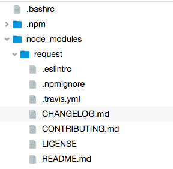

# tree-view

Tree viewing widget for the browser. Uses React so it only re-renders parts of the tree that need updating without having to re-render the entire tree on every change.

```
npm install tree-view
```

Try out the demo by doing

```
npm install
npm start
```



## Usage

``` js
var path = require('path')
var tree = require('tree-view')

var browser = tree() // or tree({style: false}) to disable styling

browser.on('directory', function(p, entry) {
  console.log('You clicked on a directory (%s)', p)
  browser.directory(p, [{
    path: path.join(p, '/foo'),
    type: 'directory'
  }, {
    path: path.join(p, '/bar'),
    type: 'directory'
  }, {
    path: path.join(p, '/baz'),
    type: 'file'
  }])
})

browser.on('file', function(p, entry) {
  console.log('You clicked on a file (%s)', p)
})

browser.directory('/', [{
  path: '/foo',
  type: 'directory'
}, {
  path: '/bar',
  type: 'directory'
}, {
  path: '/baz',
  type: 'file'
}])

browser.appendTo(document.body)
```
